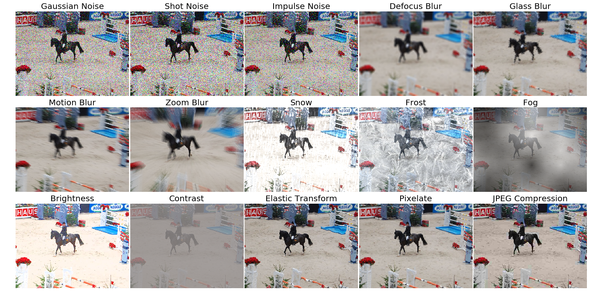

# imagecorruptions
This package provides a set of corruptions that can be applied to images in order to benchmark the robustness of neural networks. These corruptions are not meant to be used as training data augmentation but rather to test the networks against unseen perturbations. For more information have a look at the paper on the original corruption package by Hendrycks and Dietterich: [Benchmarking Neural Network Robustness to Common Corruptions and Surface Variations](https://arxiv.org/abs/1807.01697)



## Installation and Usage
This package is pip installable via `pip3 install imagecorruptions`. An example of how to use the corruption function is given below:
```python
from imagecorruptions import corrupt
...
corrupted_image = corrupt(image, corruption_name='gaussian_blur', severity=1)
...
```
Looping over all available corruptions can be done either by name or by index:
```python
# via name
from imagecorruptions import get_corruption_names
for corruption in get_corruption_names():
    for severity in range(5):
        corrupted = corrupt(image, corruption_name=corruption, severity=severity+1)
        ...

# via number:
for i in range(15):
    for severity in range(5):
        corrupted = corrupt(image, corruption_number=i, severity=severity+1)
        ...
```

Note that the first 15 image corruptions are the common corruptions (the ones you get via `get_corruption_names()`). If you really wish to use these as data augmentation, there exist four additional validation corruptions which can be accessed via `get_corruption_names('validation')` which should then be used to test the corruption robustness of the trained model.

## Credit and Changelog
This package is an extension of the image corruption functions provided by Dan Hendrycks in the repository  [corruptions](https://github.com/hendrycks/robustness). The image corruptions implemented by Hendrycks are generalized to work on images with arbitrary image dimensions and aspect ratios aswell as on grayscale images. We furthermore removed the dependency to `libmagickwand` and the python api `Wand` and reimplemented the `motion_blur` in python.
